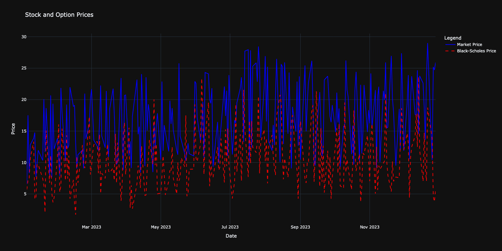
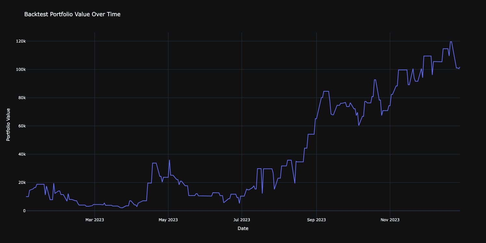

# Black-Scholes Options Trading Backtest System

This project provides an **options trading backtesting** system based on the **Black-Scholes pricing model** and **Implied Volatility**. The goal of this project is to allow you to test options trading strategies using historical stock and options data. The backtest system simulates trading by purchasing and selling options based on specific criteria and tracks the performance of a portfolio over time.


## Key Features

- **Stock Data Fetching**: Fetches historical stock data for a given ticker symbol and date range.
- **Options Data Generation and Pricing**: Generates options data, calculates theoretical option prices using the **Black-Scholes model**, and computes **Implied Volatility**.
- **Backtesting**: Simulates a simple options trading strategy using historical data to evaluate performance.
- **Visualization**: Provides visualizations for stock prices, option prices, portfolio value, and trading strategy performance.
- **Unit Testing**: Includes unit tests for critical functions like Black-Scholes calculation and implied volatility.

## Requirements

To run the project, make sure you have Python 3.7 or higher installed. You can install the required dependencies by running:

```bash
pip install -r requirements.txt
```

### Additional Requirements

`yfinance` (for fetching stock data)
`numpy`, `pandas`, `matplotlib`, `scipy` for data handling, visualization, and calculations.

## Setup and Usage
### 1. Clone the Repository
Clone this repository to your local machine:

```bash
git clone https://github.com/3lson/black-scholes-project.git
cd black-scholes-project
```

### 2. Data Loading
Before running the backtest, you'll need stock and options data.

**Stock Data**: You can either fetch stock data using the `data_loader.py` or use the pre-existing `stocks.csv` found in the `data/` folder.
**Options Data**: The options data is manually generated in the data_loader.py` module. You can use this module to create and load options data for the backtest. This allows for flexibility in generating options data that matches your test scenarios.

Use the `data_loader.py` module to generate or load options data and then save it as a CSV (such as `options_data.csv`) for use in the backtest.

### 3. Running the Backtest
To run the backtest, simply execute the `main.py` script. This will fetch the necessary data (if not already present), calculate option prices using the Black-Scholes model, and execute the backtest strategy.

```bash
python main.py
```

### 4. Backtest Strategy
The current backtest strategy is based on the following logic:

**Buy an option** when the stock price is greater than the strike price.
**Sell the option** either when the stock price falls below the strike price or after 5 days.
Track the portfolio value during each trading decision, simulating real-time trading.

The backtest results are saved in `data/backtest_results.csv`, and portfolio performance is plotted over time.

### 5. Visualizations
To view the results of the backtest, run the visualization tools found in the `plots.py` module. You can plot the stock price, options prices, and portfolio value over time. This allows you to analyze the effectiveness of the strategy visually.

### 6. Jupyter Notebook for Testing
For testing and exploration, there is a Jupyter notebook (`jupyter/black_scholes_and_greeks.ipynb`) that demonstrates how to test the Black-Scholes model and view the option pricing and Greeks in an interactive environment.

## Project Modules

`src/black_scholes.py`

This module contains the implementation of the **Black-Scholes model**. The `black_scholes` function calculates the theoretical option price for a given stock price, strike price, time to expiration, and volatility.

`src/implied_vol.py`
This module calculates **Implied Volatility** for options based on the market price of the options using the Black-Scholes model.

`src/data_loader.py`
Contains functions to generate and load options data. The `data_loader.py` module allows you to manually create options data for the backtest, providing full control over the options data you wish to test.

`src/backtest.py`
Contains the logic to execute the backtest. The `backtest` function simulates a simple trading strategy, tracks portfolio performance, and saves the results.

`src/plots.py`
Tools for visualizing the stock price data, options data, and portfolio performance. You can generate charts that show how the stock and option prices change over time.

`tests/test_black_scholes.py`
Contains unit tests for the Black-Scholes model to ensure correctness of the option pricing calculations.

## Running the Backtest

### Example Command
To run the backtest with a given stock ticker (e.g., `AAPL`), simply execute:

```bash
python3 main.py
```

This will:
1. Fetch stock and options data (if necessary).
2. Run the backtest with the defined strategy.
3. Output the backtest results to data/backtest_results.csv.
4. Plot the backtest results

### Sample Output
```plaintext
Starting backtest...
Date: 2023-12-27, Stock Price: 193.15
  Option Price: 25.19, Strike Price: 185.80
  Bought 946 contracts at price 25.19 on 2023-12-27
Date: 2023-12-28, Stock Price: 193.58
  Option Price: 24.71, Strike Price: 183.94
  Sold 946 contracts at price 24.71 on 2023-12-28
Date: 2023-12-29, Stock Price: 192.53
  Option Price: 25.90, Strike Price: 197.23
  Bought 946 contracts at price 25.90 on 2023-12-29
...
Backtest complete.
```

**Backtest Portfolio Value**: Track the value of your portfolio over time, which fluctuates based on stock and option prices. The portfolio starts at $10,000 and evolves based on trades made.

**Visualizations**: Plots showing how the portfolio grows or shrinks based on the strategy and stock movements.

## Results Analysis
The **backtest** results are saved as a CSV file (`backtest_results.csv`) in the `data/` directory. This file contains the portfolio value over time, showing how the strategy would have performed during the backtest period. You can load this data to analyze the performance of the strategy.

**Example Backtest Results**:
**Starting Capital**: $10,000
**End of Backtest**: $120,000 (after several trades)
**Performance Observations**:
- Early in the test, the portfolio experienced significant drawdowns (e.g., dropping from $10,000 to $3,000).
- However, with the right trades and the strategy in place, the portfolio recovered and grew rapidly, reaching $120,000 or more by the end of the month.

### Visual Results
To help visualize the backtest performance and the option pricing, we have included the following graphs:

1. **Stock and Option Prices (Market Price vs Black-Scholes Price)**:
A graph showing the market prices of the options alongside the Black-Scholes model prices over time.

2. **Portfolio Value Over Time**:
A graph showing the changes in portfolio value over the course of the backtest period, capturing the fluctuations and overall growth.

Below are sample images of these results:
**Stock and Option Prices**: This graph shows the market price and the Black-Scholes price of the options. The goal is to compare how the Black-Scholes model aligns with the actual market prices.



*Market Price vs Black-Scholes Price over time.*

**Backtest Portfolio Value**: This graph shows how the portfolio value evolved during the backtest period, highlighting key moments of drawdown and recovery.



*Portfolio value over time during the backtest.*

**Interpretation**:
**Stock and Option Prices**:
The comparison between market prices and Black-Scholes model prices can highlight potential inefficiencies or discrepancies in pricing, which can provide insights into the effectiveness of your strategy.

**Portfolio Growth Over Time**:
The portfolio value graph tracks the evolution of the capital, demonstrating how well the strategy performs over time. Early drawdowns are typical, but if the model is well-designed, it should show strong recovery and growth by the end of the backtest period.

## Troubleshooting
**Missing Data**: If options data is missing for a certain date, the backtest will log this and skip trades for that day.

**Insufficient Capital**: If there isn't enough capital to buy contracts, the backtest will log a message and skip that trade.

**Incorrect Calculations**: Use the unit tests to verify the correctness of the Black-Scholes calculations and implied volatility computations.

## License
This project is licensed under the MIT License. See the LICENSE file for more details.

## Future Enhancements
**Transaction Costs**: Add transaction costs to the backtest to make it more realistic. This will simulate brokerage fees and slippage in real trading.

**Complex Strategies**: Implement more sophisticated options trading strategies, such as multi-leg strategies (straddles, spreads, etc.), to increase flexibility and functionality.

**Real-Time Data Integration**: Integrate with real-time market data for live options trading simulations. This would allow testing with up-to-date market conditions.

**Performance Optimization**: Speed up the backtest process, especially for large datasets, by optimizing calculations or using parallel processing techniques.
